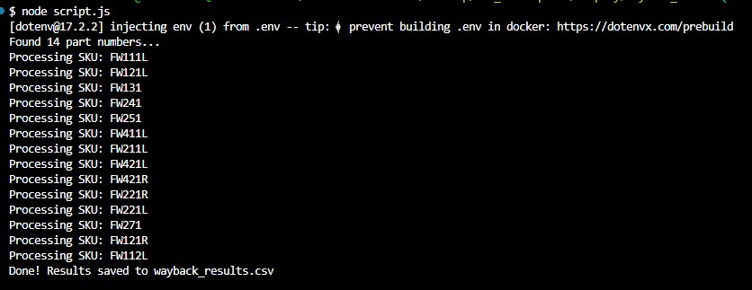

# wayback_finder

A Node.js script to help recover old product pages and images from a Shopify store using the [Wayback Machine](https://archive.org/web/).  

This tool reads a CSV of part numbers (SKUs), queries your Shopify store to find product URLs, then checks the Wayback Machine for archived snapshots. If available, it also extracts archived image URLs from the snapshot.

---

## Features

- Reads SKUs from a CSV (`parts.csv`)  
- Queries Shopify Admin API for product URLs  
- Fetches archived snapshots from the Wayback Machine  
- Extracts archived image URLs from snapshots  
- Saves results to a CSV (`wayback_results.csv`)  

---

## Installation

```bash
git clone <repo-url>
cd wayback_finder
npm install
```


Make sure to create a .env file with your Shopify Admin API credentials:

```
SHOPIFY_DOMAIN=yourstore.myshopify.com
ADMIN_API_VERSION=2025-01
ADMIN_TOKEN=your_admin_api_token
STORE_FRONT_URL=https://store.example.com
```

## Usage
```bash
node script.js
```
The script will read your SKUs, fetch Shopify product URLs, query Wayback Machine for snapshots, and save the results (with archived images) to `wayback_results.csv`.

## Output
#### CSV columns:

- `SKU` – The part number

- `Shopify URL` – Original Shopify product URL

- `Wayback Snapshot` – URL of the archived page

- `Archived Images` – Archived image URLs (pipe | separated)

#### Terminal:



# Dependencies

- [node-fetch](https://www.npmjs.com/package/node-fetch)
- [dotenv](https://www.npmjs.com/package/dotenv)
- [jsdom](https://www.npmjs.com/package/jsdom)
- [csv-parser](https://www.npmjs.com/package/csv-parser)
- [csv-writer](https://www.npmjs.com/package/csv-writer)